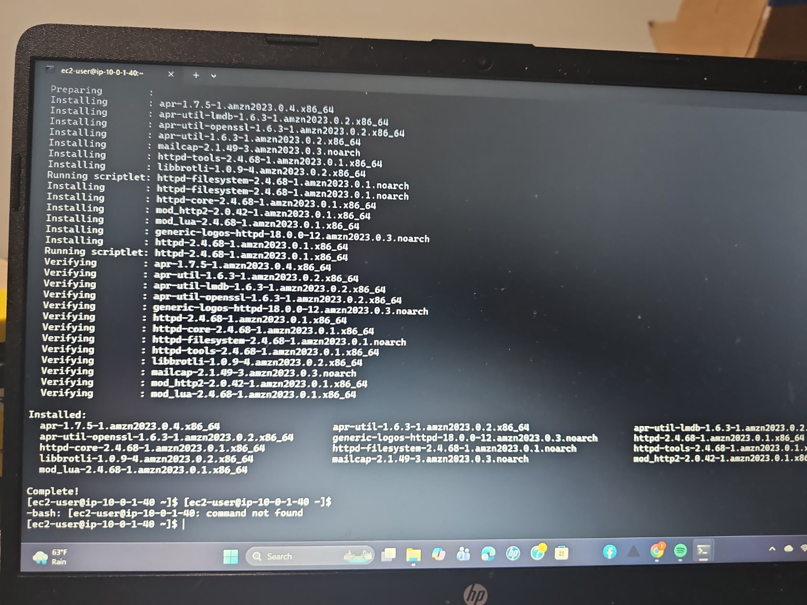
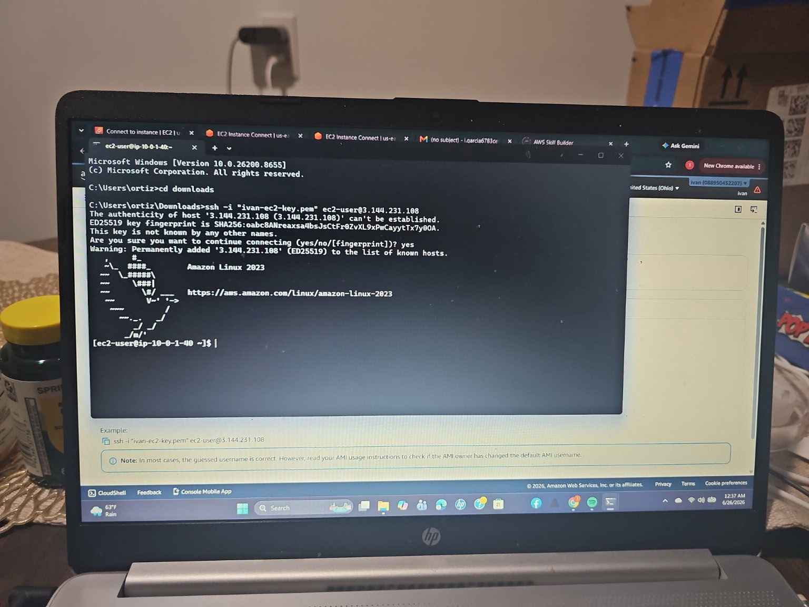
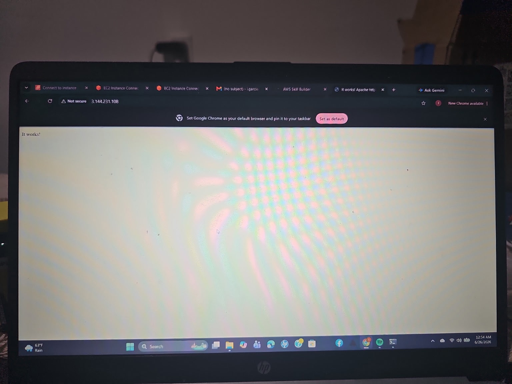
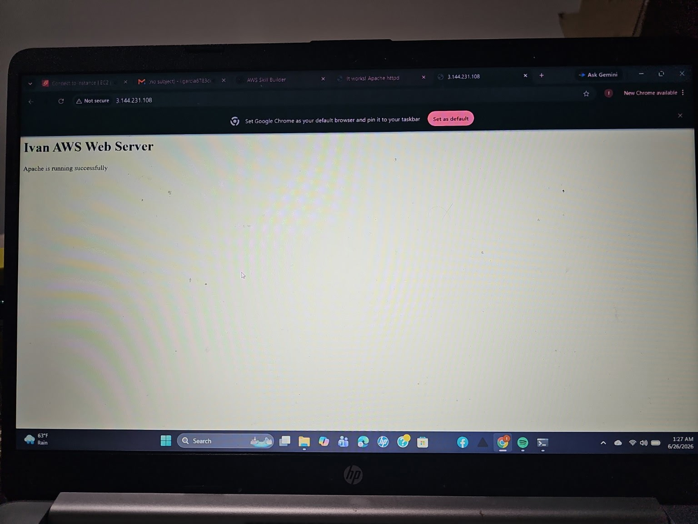

# AWS Lab 09 - Custom VPC Web Server

## Project Overview

This project demonstrates how to deploy a web server inside a custom AWS Virtual Private Cloud (VPC) using Amazon EC2 and Apache HTTP Server.

The server was configured on Amazon Linux 2023 and successfully served a custom HTML web page over HTTP.

---

## AWS Services Used

- Amazon EC2
- Amazon VPC
- Security Groups
- Amazon Linux 2023
- Apache HTTP Server (httpd)

---

## Skills Demonstrated

- Launching an EC2 instance
- Connecting with SSH
- Installing Apache Web Server
- Managing Linux services with systemctl
- Creating a custom HTML page
- Serving web content over HTTP
- Basic Linux command line administration

---

## Commands Used

```bash
sudo dnf install httpd -y
sudo systemctl enable httpd
sudo systemctl start httpd
sudo systemctl status httpd
echo "<h1>Ivan AWS Web Server</h1><p>Apache is running successfully</p>" | sudo tee /var/www/html/index.html
```

---

## Project Outcome

The EC2 instance successfully hosted a custom web page accessible through its public IP address.

---

##  Screenshots

### 1. EC2 SSH Connection


### 2. SSH Login


### 3. Apache Installation


### 4. Apache Running


#### 5. Default Apache Page
[Default Apache Page](Screenshots/IMG_20260628_210325.jpg)

### 6. Custom Web Page
[Custom Web Page](Screenshots/IMG_20260628_210327.jpg)
